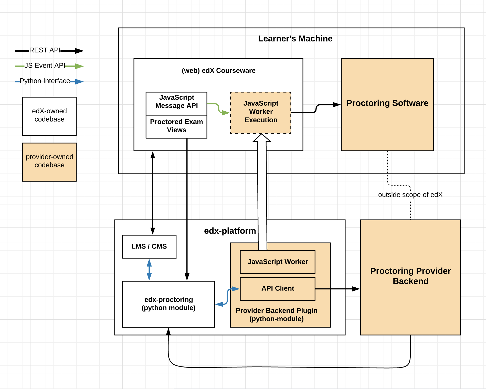
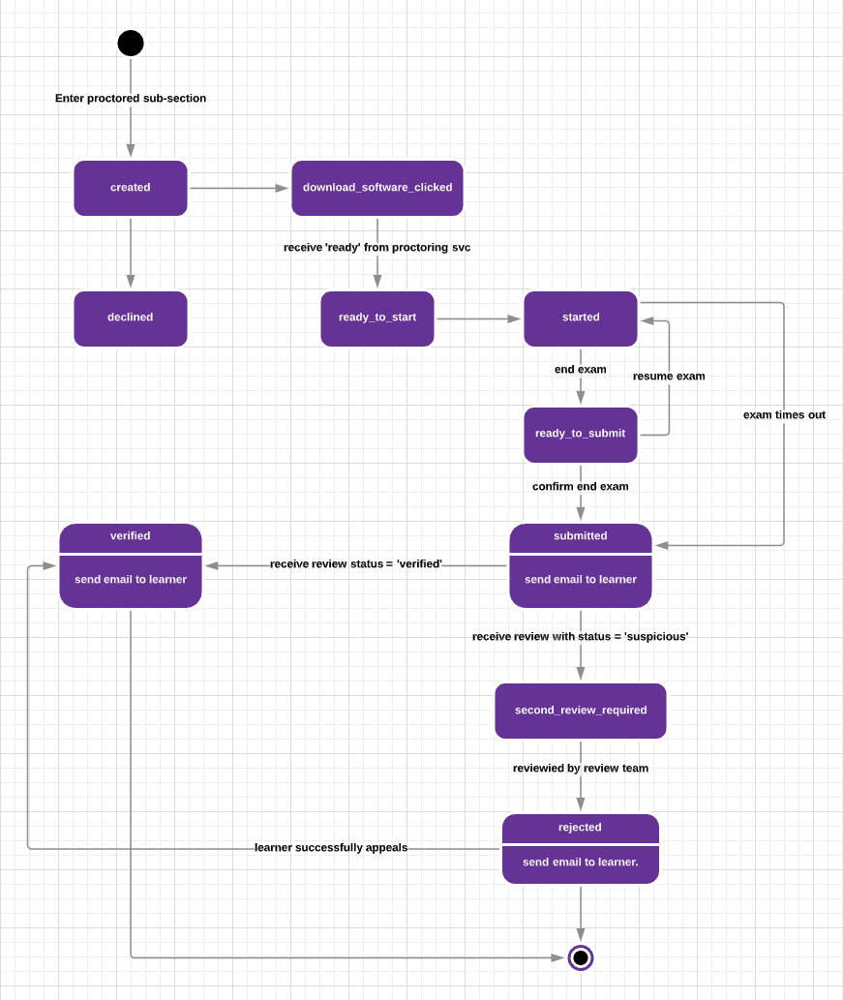

Proctoring System Overview
===========================
This document outlines the components involved in the edX proctoring system. It should
serve as a guide to orient developers on what components exist, how they interact, and 
where to find the source code in our platform.

.. contents::

System Components
------------------

Proctored Exam Views
^^^^^^^^^^^^^^^^^^^^

Interstitial views within a section that are shown to in place of the actual
exam content. They are used to walk a leaner through setup steps
and display the state of the current attempt.

templates are defined in edx-proctoring
https://github.com/edx/edx-proctoring/tree/master/edx_proctoring/templates

LMS calls into edx-proctoring to load the relevent template when rendering the
`student_view()` for a section.
https://github.com/edx/edx-platform/blob/a7dff8c21ee794e90bdc0f22876334a7843a032d/common/lib/xmodule/xmodule/seq_module.py#L274

TODO: refer to _get_proctored_exam_view here

JavaScript Message API and Worker
^^^^^^^^^^^^^^^^^^^^^^^^^^^^^^^^^
A set of functions called by edX courseware to emit messages based on changing
exam states. For example, clicking 'start exam'. These messages are handled by a 
JS worker specific to the proctoring provider. That worker is included as part of 
the the provider's python plugin installed in our platform built to
interface directly with the proctoring software running on the learner's machine.

edX Message API
https://github.com/edx/edx-proctoring/blob/master/edx_proctoring/static/proctoring/js/exam_action_handler.js

(example) Proctortrack worker
https://github.com/joshivj/edx-proctoring-proctortrack/blob/master/edx_proctoring_proctortrack/static/proctortrack_custom.js

edx-proctoring
^^^^^^^^^^^^^^
Python plugin that handles the bulk of edX's proctoring logic. A short-list of key responsibilities:
 #. Models for proctored exam configuration and learner attempts.
 #. Exposes a REST API for providers to manage exams and attempts.
 #. Includes a Python API for edX platform to manage exams and attempts.
 #. Communicates exam attempt states to the provider's backend through their plugin.
 #. Handle's interstitial rendering logic based on attempt status
https://github.com/edx/edx-proctoring

Python plugin that handles the bulk of edX's proctoring logic. It hosts the models for proctored
exam configuration and learner attempts and exposes a REST and Python interface to manage them.
edx-proctoring also handles calling out the the providers backend (through a plugin) to keep
exams and attempts in-sync between the two systems.

provider-specific plugin
^^^^^^^^^^^^^^^^^^^^^^^^
Integration layer to handle making REST/http requests to the provider's backend.
More information on configuring backends can be found here: https://github.com/edx/edx-proctoring/blob/master/docs/backends.rst

We have two backends installed in edx-platform:
https://github.com/joshivj/edx-proctoring-proctortrack
RPNOW?

Exam States and User Flow
--------------------------
When a learner first enters a proctored exam subsection an exam attempt is created
in the edX system. User actions and the proctoring software will update the status of
this attempt. The following diagram describes the user flow through those status
updates.

todo mention various prereqs

Example Action Sequence
-------------------------

The diagram below describes the sequence of interactions for sucessfully entering and beginning
a proctored exam.

=, for sections
-, for subsections
^, for subsubsections
“, for paragraphs