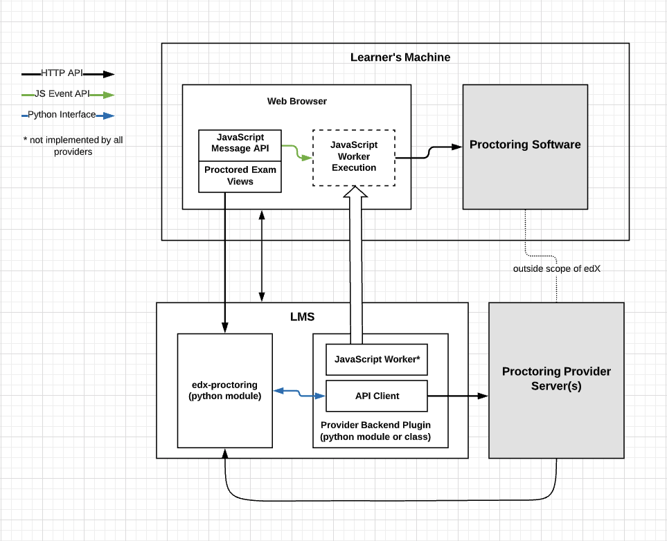
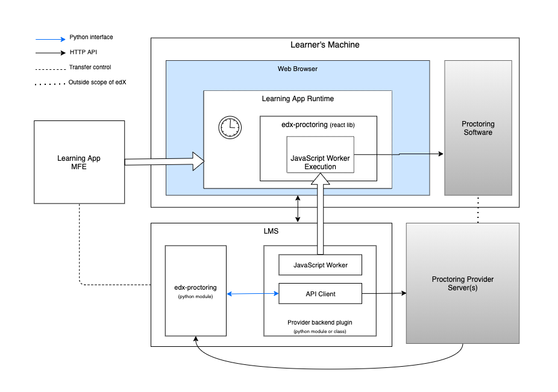
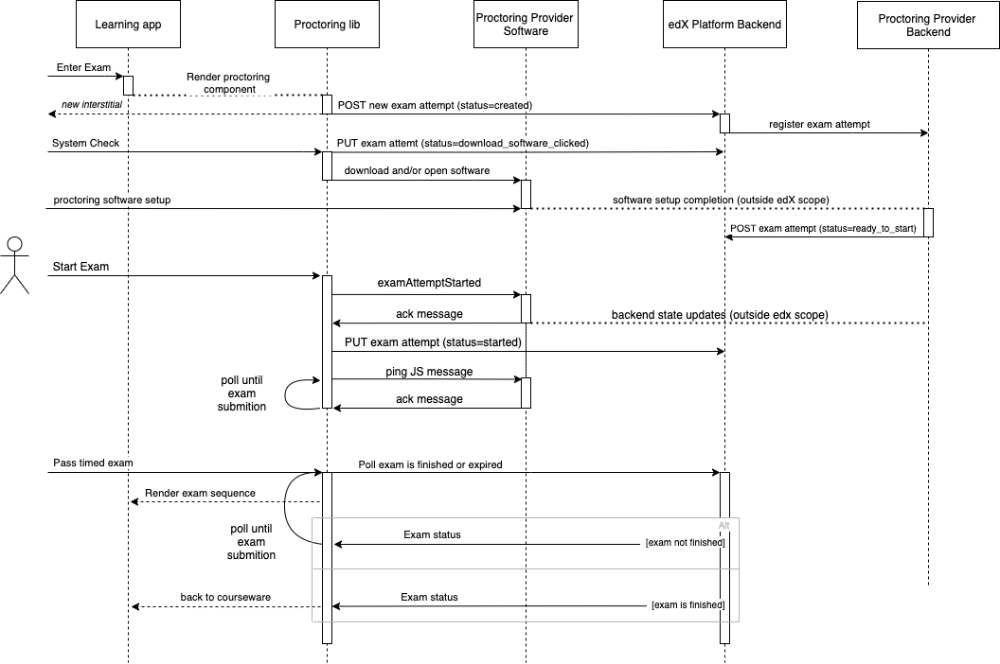

Proctoring System Overview
===========================
This document outlines the components involved in the edX proctoring system. It should
serve as a guide to orient developers on what components exist, how they interact, and
where to find the source code in our platform.

.. contents::

System Components
-----------------

Legacy Components Schema
^^^^^^^^^^^^^^^^^^^^^^^^

New Components Schema with Learning MFE and special exam lib
^^^^^^^^^^^^^^^^^^^^^^^^^^^^^^^^^^^^^^^^^^^^^^^^^^^^^^^^^^^^

Proctored Exam Views
^^^^^^^^^^^^^^^^^^^^

During a proctored exam, LMS renders different student views based on the status
of that exam attempt. The LMS renders the views by calling into edx-proctoring and loading
the relevent html templates.

The goal of these interstitials is to guide the learner through
the many steps of attempting a proctored exam, where at many steps there are
critical details about what the learner needs to do or understand. As such,
some of the copy on these interstitials is very important.

Notable Code:

- `LMS render student_view() <https://github.com/openedx/edx-platform/blob/a7dff8c21ee794e90bdc0f22876334a7843a032d/common/lib/xmodule/xmodule/seq_module.py#L274>`_
- `edx-proctoring template logic <https://github.com/openedx/edx-proctoring/blob/78976d93ab6ca5206f259dc420d2f45818fe636c/edx_proctoring/api.py#L1912>`_
- `edx-proctoring interstitial templates <https://github.com/openedx/edx-proctoring/tree/323ea43acbd6f12d5131546e8648dedff719bf9e/edx_proctoring/templates>`_
- `Learning MFE <https://github.com/openedx/frontend-app-learning>`_
- `React lib for special exams <https://github.com/edx/frontend-lib-special-exams/>`_

edx-proctoring
^^^^^^^^^^^^^^
Python plugin that handles the bulk of edX's proctoring logic. It hosts the models for proctored
exam configuration and learner attempts.  It exposes a REST and Python interface to manage them.
edx-proctoring is also responsible for calling out to the provider's backend (through a plugin) to keep
exam configuration and learner attempts in-sync between the two systems.

Provider Backend Plugin
^^^^^^^^^^^^^^^^^^^^^^^^
Integration layer to handle making REST/http requests to the provider's backend.
This can exist as a Python module or be committed directly into edx-proctoring as a backend.

`More information on configuring backends <https://github.com/openedx/edx-proctoring/blob/master/docs/backends.rst>`_

We have one real backend currently used in production:

1. RPNow: https://github.com/openedx/edx-proctoring/blob/447c0bf49f31fa4df2aa2b0339137ccfd173f237/edx_proctoring/backends/software_secure.py

For testing backends see `mockprock <https://github.com/openedx/edx-proctoring/blob/master/docs/developing.rst#using-mockprock-as-a-backend>`_

JavaScript Message Interface
^^^^^^^^^^^^^^^^^^^^^^^^^^^^
A set of functions called by edX courseware to emit browser messages. Certain providers
may choose to handle these events to facilitate direct communication between the browser
and a desktop application.  Messages are emitted when the exam content is started and ended.
Additionally a ping message will poll at a configurable interval. Successful callback responses
are required for each of these messages to keep the exam from entering an error state.

Message Interface: `exam_action_handler.js <https://github.com/openedx/edx-proctoring/blob/master/edx_proctoring/static/proctoring/js/exam_action_handler.js>`_

Exam States
-----------
When a learner first enters a proctored exam subsection an exam attempt is created
in the edX system. User actions and the proctoring provider will update the status of
this attempt as the exam is completed and reviewed. The following diagram describes the
flow through those status updates.

Detailed descriptions of each potential attempt state can be found below. It should be noted that there
are minor differences in the review process between RPNow and Proctortrack exams.

- `Proctortrack status values <https://docs.openedx.org/en/latest/educators/how-tos/proctored_exams/review_pt_results.html>`_
- `RPNow status values <https://docs.openedx.org/en/latest/educators/how-tos/proctored_exams/review_rpnow_results.html>`_

This figure does not include error states or display of unmet prerequite requirements.

.. image:: images/attempt_states.png

Example Action Sequence
-------------------------

The diagrams below describes the happy-path of interactions between components to
sucessfully begin a proctored exam. These examples matches Proctortrack's backend
implementation and includes any JavaScript events handled by the proctoring app.

Old Sequence
^^^^^^^^^^^^

.. image:: images/sequence.png

New Sequence with Learning MFE and special exam lib
^^^^^^^^^^^^^^^^^^^^^^^^^^^^^^^^^^^^^^^^^^^^^^^^^^^

